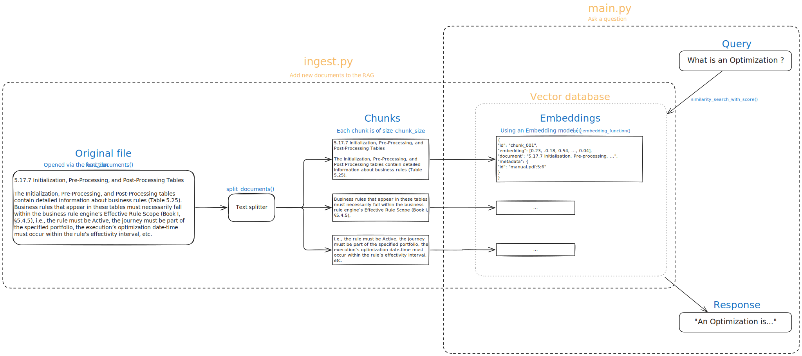
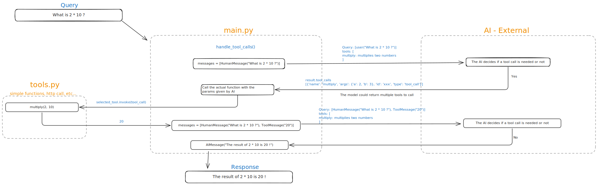

# AI RAG Template (LangChain + HuggingFace + Openai + Chroma)

This is a **Retrieval-Augmented Generation** (RAG) starter template.
It loads documents from the `data/` folder, stores them in a Chroma vector database, and answers questions by retrieving relevant chunks and passing them to a Large Language Model (LLM).

---

## Project Structure

```
data/                     # Place your PDFs and TXT files here
chroma/                   # Auto-generated Chroma vector database
ingest.py                 # Script to load documents into Chroma
main.py                   # Script to query the database via RAG
get_embedding_function.py # Selects the embedding model
readme.md                 # This file
```

## Prerequisites

- **Python 3.10+**

---

## Installation

### 1. Create a Virtual Environment

```bash
python -m venv .venv
```

### 2. Activate the Virtual Environment

**Linux / macOS:**

```bash
source .venv/bin/activate
```

**Windows:**

```bash
./.venv/Scripts/activate
```

### 3. Install dependencies

Project dependencies are listed in the requirements.txt file.

To install them, run the following command:

```bash
pip install -r requirements.txt
```

If needed, you can add new dependencies to the file and re-run the command to install them.

### 4. Create a .env file

```.env
AZURE_OPENAI_ENDPOINT=
AZURE_OPENAI_API_KEY=
APPIA5_BASE_URL=
APPIA5_API_TOKEN=
```

## Ingesting Data

Place your documents in the `data/` folder (create it if it does not already exist), then run:

```bash
python ingest.py --reset
```

- `--reset` clears the database before re-ingesting.
- Without `--reset`, only new documents will be added.

---

## Asking Questions

Once data is ingested, ask a question:

```bash
python main.py "What is Appia?"
```

---

## Customization

- An LLM bases itself on two things to generate an answer:

  1. **The Context** → the information you provide to the model beforehand (documents ingested, split into chunks, transformed into embeddings and stored in a vector database, or conversation history). This is the knowledge base the model can draw from. \
     In this project, this is done via the _ingestion_ process. See [Ingesting Data](#ingesting-data)

  2. **The Prompt** → the actual question or instruction you send to the model at query time. This guides how the model should use the context (e.g., “Summarize this”, “Answer as a lawyer”, “Translate into Italian”). \
     In this project, the prompt is stored in the `PROMPT_TEMPLATE` variable.

- Read documentation: https://python.langchain.com/docs/integrations/chat/azure_chat_openai/

- Change embedding model in get_embedding_function.py:

```python
HuggingFaceEmbeddings(model_name="sentence-transformers/all-MiniLM-L6-v2")
```

- Adjust chunk size in ingest.py for more/less context.

---

## Resources

### Rag/Database

- [LangChain Document Loaders](https://python.langchain.com/docs/integrations/document_loaders/)
- [Chroma Vector DB](https://docs.trychroma.com/)

### Tool calling

- [Quickstart](https://docs.langchain.com/oss/python/langchain/quickstart)
- [Tools](https://docs.langchain.com/oss/python/langchain/tools)
- [Agent](https://docs.langchain.com/oss/python/langchain/agents)
- [Streaming](https://docs.langchain.com/oss/python/langchain/streaming)
- [OpenAi tools guide](https://platform.openai.com/docs/guides/tools?tool-type=remote-mcp)

---

## RAG Diagram



## Tool call Diagram


